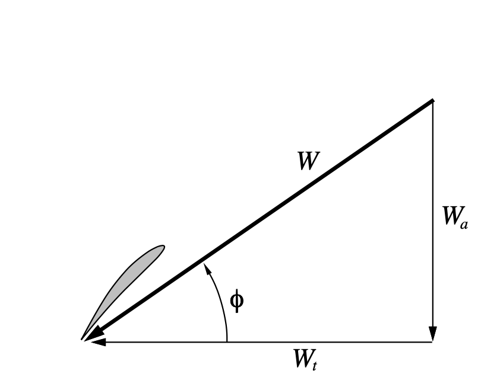
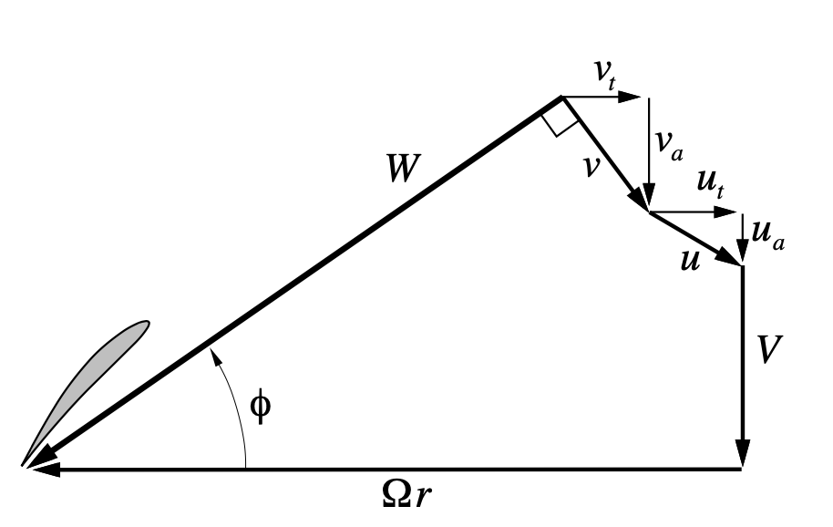

gvcalc.f
========

This routine is the heart of the propeller performance calculation. The theory behind
the calculations in this routine can be found in the **qprop_theory.txt** file
available on the *QProp* website* [Qprop
Theory]https://web.mit.edu/drela/Public/web/qprop/qprop_theory.pdf().

Here are the input parameters: 

..	literalinclude::	../../master/Qprop/src/gvcalc.f
    :lines: 38-52

The output parameters are listed next:

..	literalinclude::	../../master/Qprop/src/gvcalc.f
    :lines: 54-64

From the theory doc, here are two figures that detail the velocity conponents
around a secion of the propeller at a radius **R** from the axis:

In these figures, these equations hold:

..  math::

    W_a = V + u_a + v_a

    W_t = \Omega r -u_t -v_t

    W = \sqrt{W_a^2 + W_t^2}

Where:

* **V** is the free-stream velocity (**VEL**)
* **r** is the radial position of the blade section
* :math:`\Omega` is the rotation rate of the propeller (**OMG**)

For our rubber powered models the values of :math:`u_q` ns :math:`u_t` are bith
zero since they are related to  possible  upstream systems, like counter
rotating propellers.

The calculations are carried out for one specific radial position specified by
the input **R** value. That means this routine will be called for each radial
position ot complete the propeller analysis.

Psi Iteration
-------------

The basic logic incolved performing a *Newton's Iteration* to find the value of
"math"`\Psi` for this radial position. The input data provides the needed
aerodynamic properties for the blade at this location.

*Newton's method* assumes the existence of a function the describes the property
needed (:math::`\Psi`). We are interested in calculating the value of this
function at a specified value of he dependent variable. We start with an
initial guess for the solution and calculate the next solution based on the ratio of the function and its derivative at that initial point. The solution proceeds by repeating this calculation using the first result as the next guess. If the function is smooth and the initial guess is close enough, this scheme converges quickly.
guess. Here is the scheme:

..  math::

   x_1 = x_0 + \frac{f(x_o)}{f^`(x_0)}

Successive guesses follow the same pattern:

..  math::

   x_{n_1} = x_n + \frac{f(x_n)}{f^`(x_n)}

The nitial guess is set as the maximum of these two values:

..  math::

    \Psi_1 &= atan2(u_a, u_t) \\
    \Psi_2 &= \beta + Cl_0/DCLDA

Here is the complete source file:

..	literalinclude::	../../master/Qprop/src/gvcalc.f
